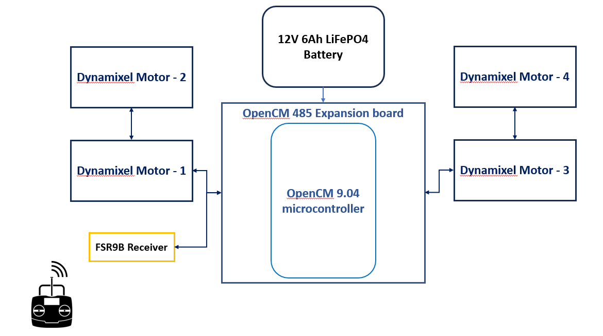

# Holonomic Pipe Traversal Robot using Mecanum & Omni Wheels

M.Tech Mini Project, Department of Robotics & AI, Nitte Meenakshi Institute of Technology (NMIT), Bengaluru (2025–26)

**Author:** Ashwin Anil
**Guide:** Mr. Sunil Kumar H S, Asst. Professor  |  **Co-Guide:** Dr. Prashanth N, Assoc. Professor & Head

## Overview

This robot clamps around the outside of a cylindrical pipe. It can climb, descend and rotate around the pipe without being repositioned. A ring-type semi-circular frame carries four driven **Mecanum wheels** and four passive **Omni wheels**, mounted on spring-loaded hinged arms. The angled Mecanum rollers produce force along the pipe axis and around its circumference, so the robot can move in both directions.

## Key Features

- **Holonomic motion:** climbs up and down, and rotates clockwise and counter-clockwise around the pipe
- **Adaptive clamping:** spring-loaded hinged arms keep every wheel in contact with the pipe
- **Closed-loop actuation:** 4× Dynamixel XC430-W240-T smart servos in velocity mode
- **Wireless control:** 2-channel RC input, velocity mixing and a stop on signal loss

## Hardware

| Component | Details |
|---|---|
| Actuators | 4× Dynamixel XC430-W240-T (1.9 N·m stall torque @ 12 V) |
| Controller | ROBOTIS OpenCM 9.04 + OpenCM 485 Expansion Board |
| RC Receiver | FlySky FS-R9B (CH2 = climb, CH4 = rotate) |
| Power | 12 V 6 Ah LiFePO4 battery |
| Wheels | 4× Mecanum (driven), 4× Omni (passive) |
| Frame | FDM 3D-printed PLA, designed in Autodesk Fusion 360 |

<p align="center">
  
</p>

## Firmware

`firmware/Final_Mini_Project_Code_with_RC/Final_Mini_Project_Code_with_RC.ino`

- Written for the **OpenCM 9.04** in the Arduino IDE, using the [Dynamixel2Arduino](https://github.com/ROBOTIS-GIT/Dynamixel2Arduino) library (Protocol 2.0, 1 Mbps)
- Reads the RC PWM inputs with `pulseIn()` every ~20 ms
- `pwmToRPM()` maps 1000–2000 µs to −40…+40 RPM, with a ±40 µs deadband around 1500 µs
- Any reading outside 1000–2000 µs is treated as neutral (1500 µs), so the motors stop if the signal is lost

**Velocity mixing**

| Command | Left motors (ID 1, 2) | Right motors (ID 3, 4) | Motion |
|---|---|---|---|
| Climb up | −ve | +ve | Vertical ascent |
| Climb down | +ve | −ve | Vertical descent |
| Rotate CW | +ve | +ve | Clockwise rotation |
| Rotate CCW | −ve | −ve | Counter-clockwise rotation |

### Upload

1. Install the OpenCM 9.04 board package and the **Dynamixel2Arduino** library in the Arduino IDE.
2. Set the motor IDs to 1–4, the baud rate to 1 Mbps and the protocol to 2.0 (for example, with DYNAMIXEL Wizard 2.0).
3. Connect the RC receiver CH2 → pin 10 and CH4 → pin 11.
4. Select the OpenCM 9.04 board and upload.

## Results

The robot was tested on an 8-inch PVC pipe in the lab:

| Requirement | Outcome | Status |
|---|---|---|
| FR1 – Static grip | Held position under its own weight, no drift | ✅ Pass |
| FR2 – Vertical climbing | Controlled ascent and descent | ✅ Pass |
| FR3 – Circumferential rotation | CW and CCW rotation demonstrated | ✅ Pass |

Test videos: [`media/videos/test_video_1.mp4`](media/videos/test_video_1.mp4), [`media/videos/test_video_2.mp4`](media/videos/test_video_2.mp4)

## Documentation

Full project report: [`docs/Mini_Project_Report_Ashwin_Anil.pdf`](docs/Mini_Project_Report_Ashwin_Anil.pdf)

## Repository Structure

```
├── docs/        Project report
├── firmware/    OpenCM 9.04 Arduino sketch
└── media/
    ├── images/  Electronics block diagram
    └── videos/  Validation test videos
```

## Future Work

- Camera, ultrasonic and thermal sensor payloads for inspection
- Encoder + IMU odometry for autonomous surface coverage
- A wider range of pipe diameters
- Wireless telemetry (Wi-Fi / LoRa)
